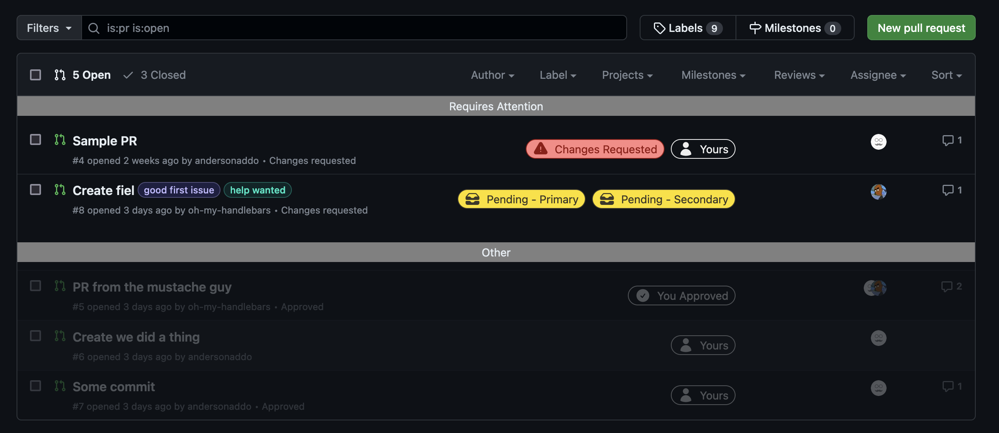

This is a userscript I wanted to use typescript for.

I found this nice webpack template from [this repo](https://github.com/Trim21/webpack-userscript-template?tab=WTFPL-1-ov-file), and decided to clean it up for my purposes.

Its original README file is in the /docs directory.

If you look into the git history, you should find when I *just* cleaned this template up before I used it for this current userscript; I think it's a good starting point for my more complex userscripts moving forward.

-------

To build you own dist js file (bundled userscript js):
npm install
npm run buildProd

-------

Made this for my work workflow to make it easier to focus on PRs that actually need my attention.

### How this works (also on Greasyfork)
This script makes use of GraphQL queries to fetch more information on PRs.
When the script realizes you're on the /pulls page of your repo, it queries the GraphQL
api to fetch more PR info. To do this, it'll need a Github Access Token to do the 
queries in your name. Only read access to repos is needed. You *can* decide to use
Github's new fine-grained tokens, but not all Github teams allow that (which matters, if 
you're using this for work like I do). The classic Github tokens have a better chance of 
being supported by your Github team.

Regardless of which repo's /pulls page you're on and which arguments you're searching against,
this script always uses the same arguments to query the GraphQL:

`is:open is:pr involves:@me archived:false repo:${repo}`

where `repo` is also something you provide on setup once the script is supplied.

The script caps the number of PRs it fetches from the api. If there's any PR being shown on the /pulls page
that wasn't in the api response (whether the script reached it's cap *or* the PR doesn't match
the predefined query), the script just won't sort it (so it won't be put under any header
and won't be given any badges).

There are 3 headers:
- Requires Attention: PRs that are yours with but have no assignee, PRs that are with changes requested, or a PRs you haven't reviewed but they requested a [new] review from you.
- Others - Yours: PRs that are yours but don't require attention
- Others - Misc: PRs that are not yours and don't require attention
